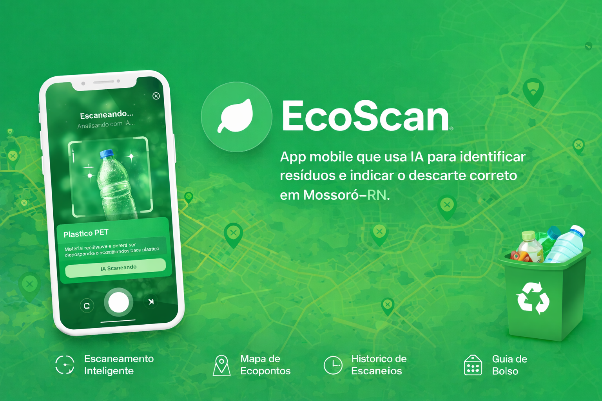
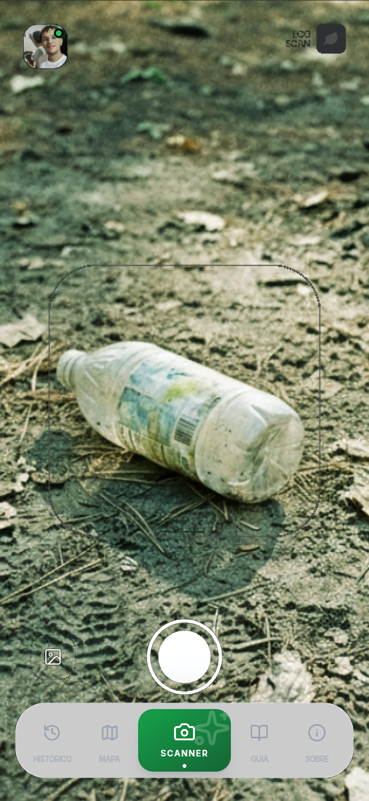
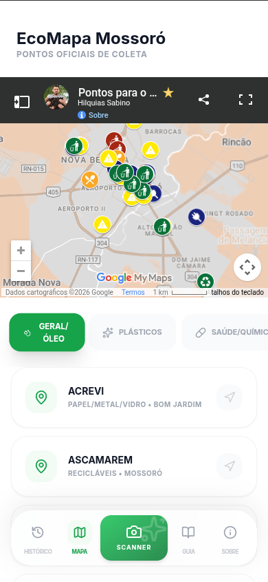
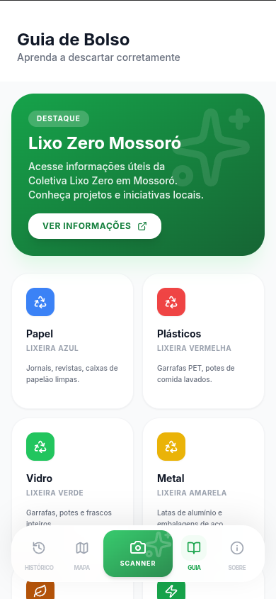
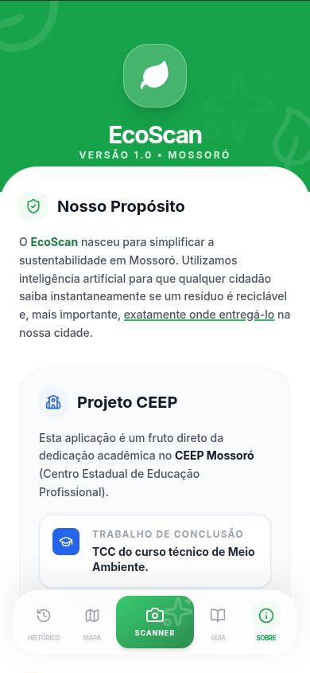

  

# 🌱 EcoScan

> **Educação ambiental na palma da mão.**  
> Um aplicativo mobile inteligente que transforma o ato de reciclar em um hábito simples, consciente e acessível.

---

## 📌 Visão Geral

O **EcoScan** é um aplicativo mobile focado em **sustentabilidade e educação ambiental**, desenvolvido como **Trabalho de Conclusão de Curso (TCC)** do **Ensino Médio Técnico Integrado** do
**Centro Estadual de Educação Profissional Professor Francisco de Assis Pedrosa**, no **Curso Técnico em Meio Ambiente**.

O aplicativo permite que o usuário **escaneie objetos e resíduos**, obtenha **informações detalhadas sobre o material**, seu **nível de sensibilidade ambiental**, **composição**, e descubra **como e onde descartá-los corretamente** dentro do **município de Mossoró, Rio Grande do Norte**.

Mais do que um app, o EcoScan é uma **ferramenta de conscientização**, criada para incentivar hábitos sustentáveis, fortalecer a educação ambiental e contribuir diretamente para o **desenvolvimento sustentável**.

---
## Como acessar?

- 🌎 [Site](https://ecoscan1.vercel.app)
- 👾 [Releases](https://github.com/Porozin/EcoScan/releases)

---

## 🎯 Objetivos do Projeto

- 🌍 Incentivar práticas de reciclagem e descarte correto
- 📚 Promover educação ambiental de forma acessível e interativa
- 📱 Oferecer uma solução mobile rápida, intuitiva e moderna
- 🧠 Utilizar Inteligência Artificial para análise de resíduos
- 🗺️ Facilitar o acesso a ecopontos locais
- ♻️ Estimular hábitos sustentáveis no cotidiano do usuário

---

## 🚀 Funcionalidades Principais

  

### 📷 Escaneamento Inteligente
- Análise de imagens de resíduos por meio de **IA**
- Identificação automática do tipo de material
- Informações sobre composição, impacto ambiental e sensibilidade

  

### 🧭 Mapa de Ecopontos
- Visualização de pontos de descarte no **Rio Grande do Norte**
- Integração com mapas interativos
- Facilidade para encontrar locais de reciclagem próximos

### 🕘 Histórico de Escaneamentos
- Registro de todos os itens analisados pelo usuário
- Acompanhamento do impacto sustentável ao longo do tempo

  

### 📖 Guia de Bolso Ambiental
- Conteúdo educativo rápido e prático
- Dicas de reciclagem, descarte e sustentabilidade

### 🔐 Autenticação Segura
- Login **exclusivamente via Google**
- Simplicidade e segurança no acesso

---

## 🎨 Design & Experiência do Usuário

- ✨ Interface moderna e limpa
- ⚡ Navegação rápida e fluida
- 📱 Design mobile-first
- 🧩 Componentes reutilizáveis e bem estruturados
- 🌿 Estética alinhada à temática ambiental

O EcoScan foi pensado para ser **fácil, rápido, intuitivo e agradável**, tornando a educação ambiental algo natural no dia a dia do usuário.

  

---

## 🧱 Arquitetura & Qualidade de Código

O projeto foi desenvolvido seguindo **boas práticas de engenharia de software**, com foco em:

- Alta **qualidade de código**
- **Modularização** bem definida
- **Escalabilidade**
- **Manutenibilidade**
- Documentação clara

Esses critérios são fundamentais, pois o projeto será **avaliado por uma banca acadêmica**.

---

## 🛠️ Tecnologias Utilizadas

### 📱 Front-end Mobile
- **React Native**
- **Expo**
- **TypeScript**
- **NativeWind (Tailwind para React Native)**
- **Lucide React Native (ícones)**
- **React Native Maps**

### 🧠 Inteligência Artificial
- **Google Gemini API**
  - Análise de imagens de resíduos
  - Geração de descrições e classificações ambientais

### 🗄️ Back-end & Banco de Dados
- **Supabase**
- **PostgreSQL**

---

## 🌎 Impacto Ambiental e Social

O EcoScan busca resolver um problema comum do cotidiano:

> "Onde eu posso descartar isso corretamente?"

Com apenas alguns toques:
1. O usuário escaneia um objeto
2. Aprende sobre seu impacto ambiental
3. Descobre como e onde descartá-lo
4. Passa a desenvolver **hábitos mais sustentáveis**

Esse processo simples gera **conscientização**, **educação ambiental prática** e contribui para uma sociedade mais responsável com o meio ambiente.

---

## 🏫 Contexto Acadêmico

- 📘 **Projeto:** TCC (Trabalho de Conclusão de Curso)
- 🏫 **Instituição:** Centro Estadual de Educação Profissional Professor Francisco de Assis Pedrosa
- 🎓 **Curso:** Técnico em Meio Ambiente
- 📚 **Nível:** Ensino Médio Técnico Integrado

---

## 🌱 Considerações Finais

O **EcoScan** nasce com o propósito de mostrar que **tecnologia e sustentabilidade caminham juntas**. Ao unir **Inteligência Artificial**, **desenvolvimento mobile** e **educação ambiental**, o projeto demonstra como soluções digitais podem gerar impacto real na sociedade.

Pequenas ações, quando facilitadas pela tecnologia, podem transformar hábitos — e hábitos sustentáveis constroem um futuro melhor.

---

  🌍 <strong>EcoScan</strong> — Tecnologia a favor do planeta.

